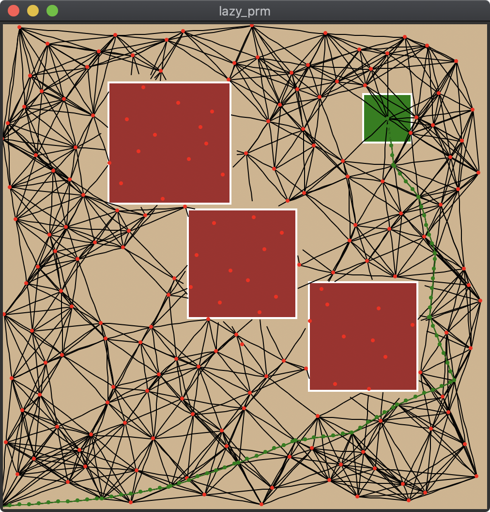
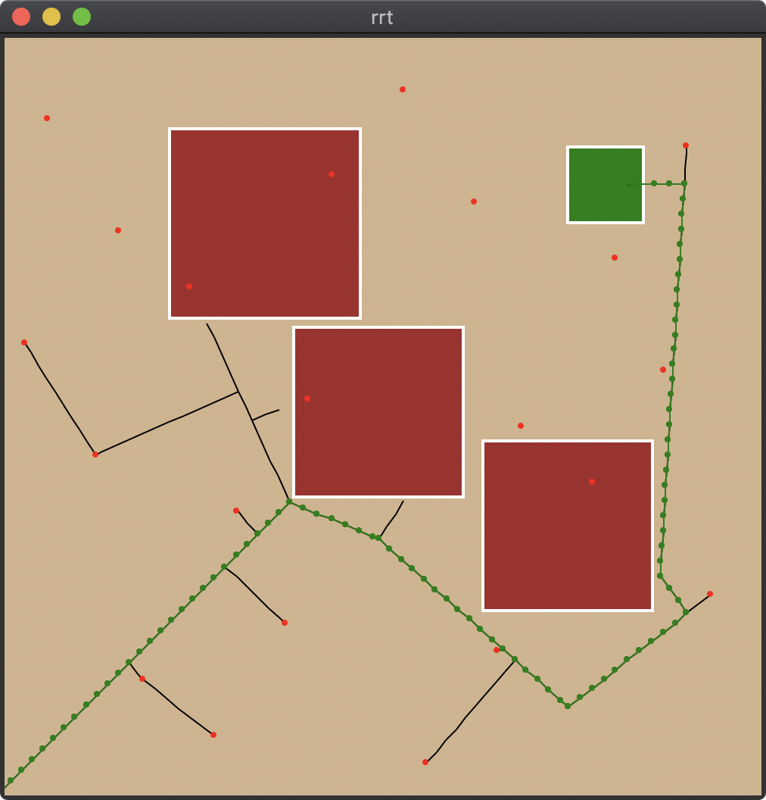
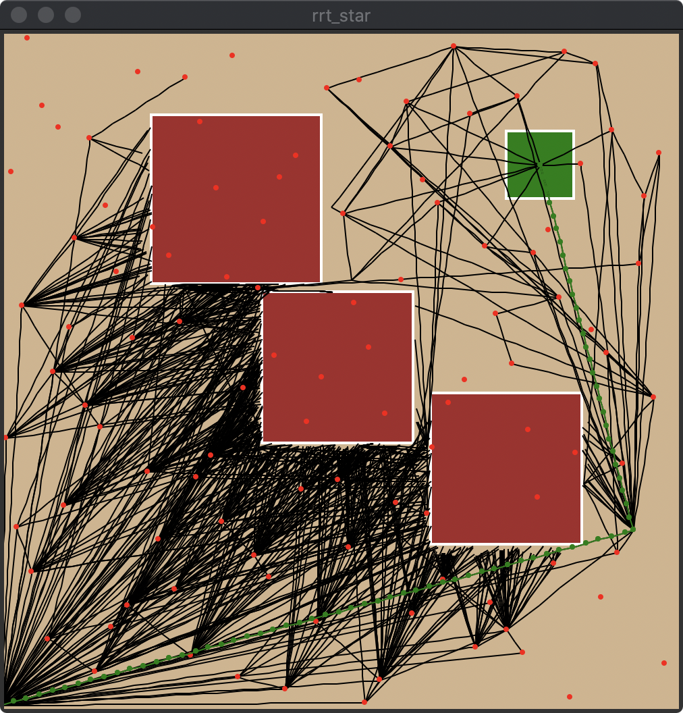
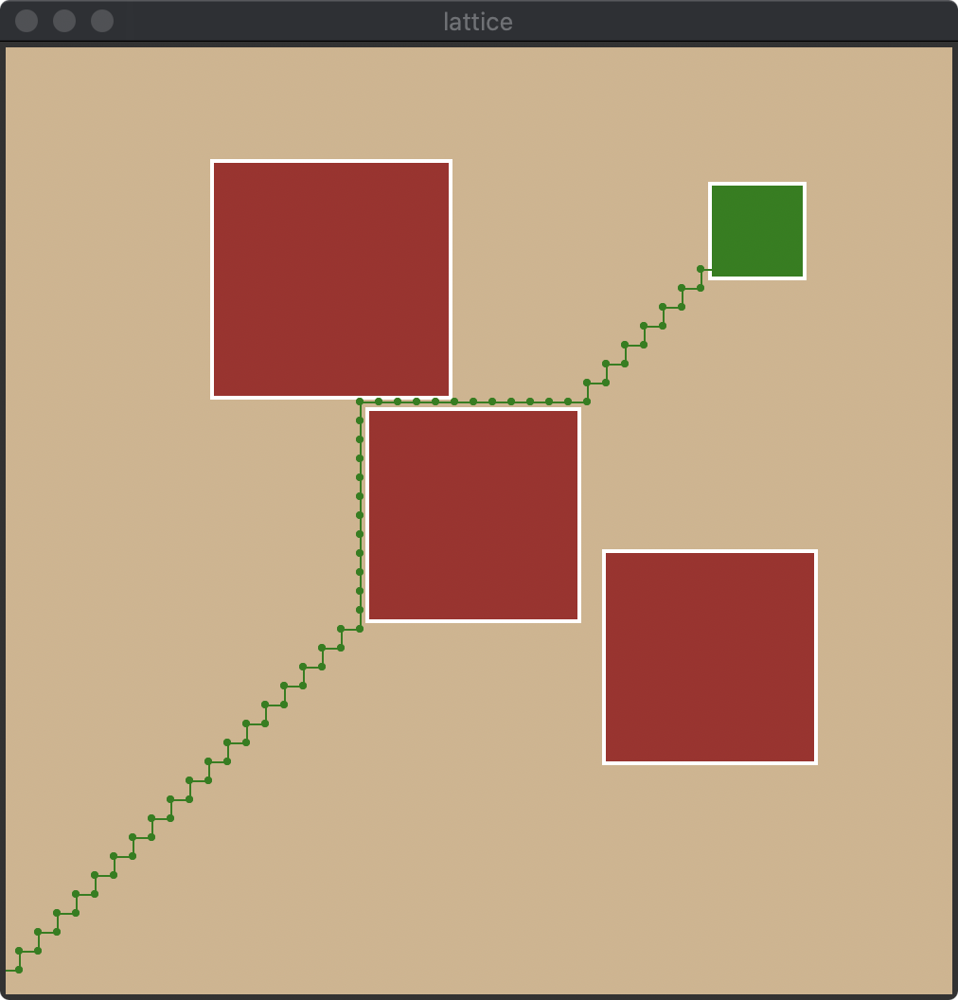
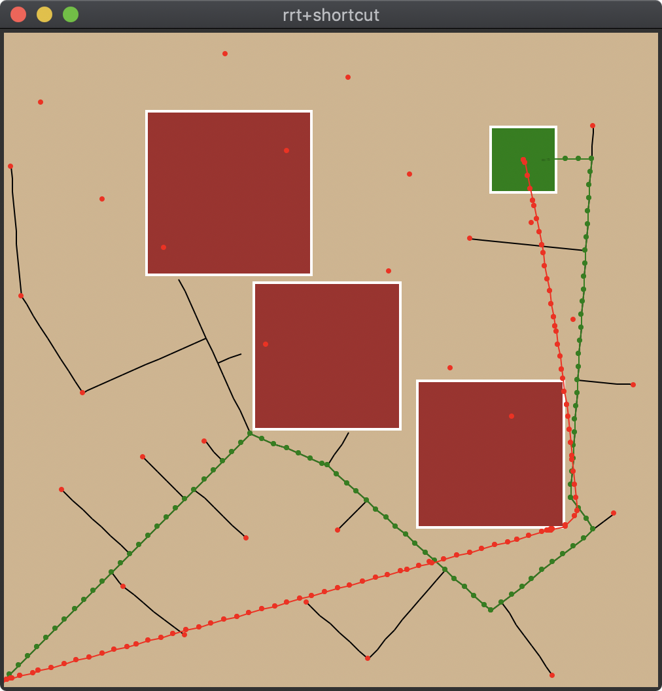
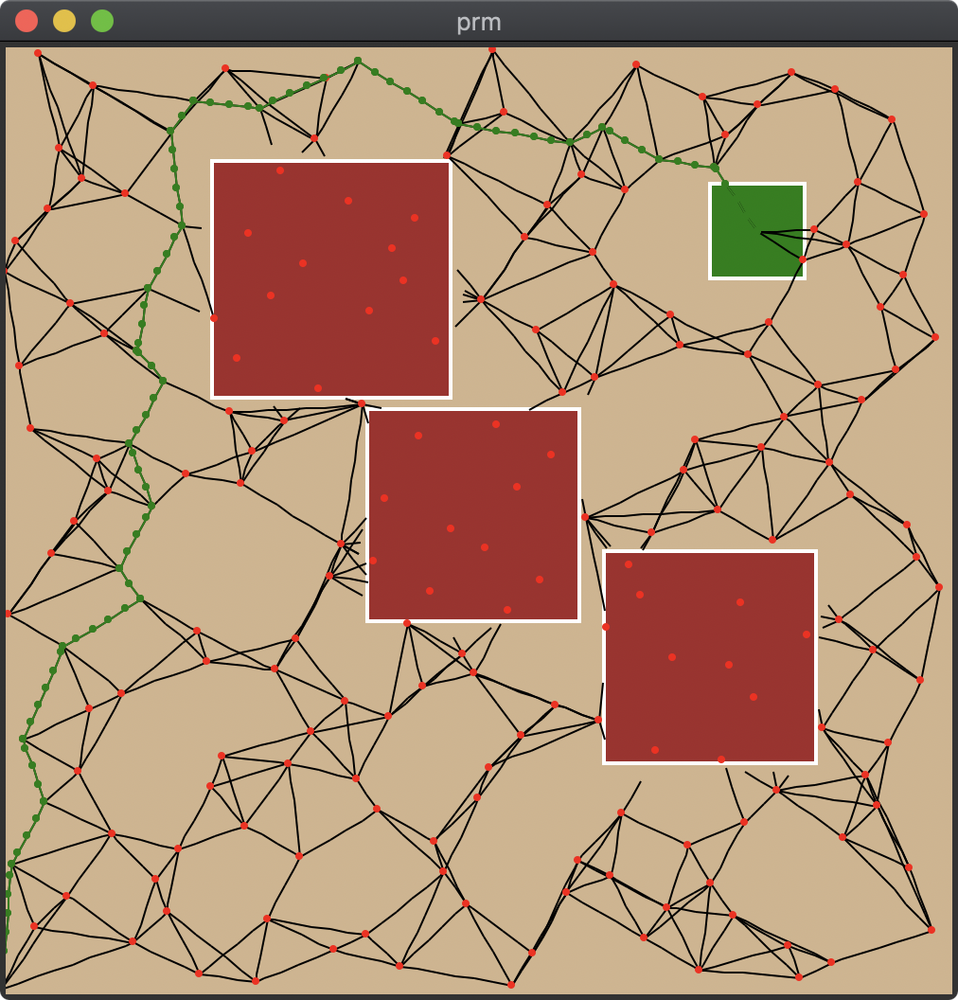
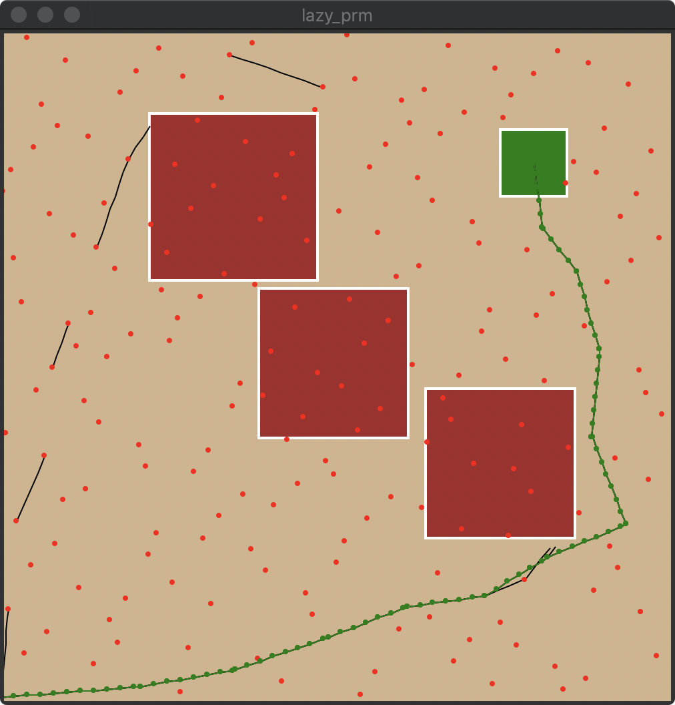

# motion-planners

Flexible python implementations of several robotic motion planners.

## Citation

Caelan Reed Garrett. Motion Planners. https://github.com/caelan/motion-planners. 2017.

## Example

A simple motion planning problem in 2D workspace and 2D configuration space that only depends on Tkinter.

`motion-planners$ python -m motion_planners.tkinter.run`

## Algorithms

### Single-Query

Sampling-Based:
* [Rapidly-Exploring Random Tree (RRT)](https://github.com/caelan/motion-planners/blob/master/motion_planners/rrt.py)
* [Bidirectional RRT (BiRRT/RRT-Connect)](https://github.com/caelan/motion-planners/blob/master/motion_planners/rrt_connect.py)
* [MultiRRT](https://github.com/caelan/motion-planners/blob/master/motion_planners/multi_rrt.py)
* [RRT*](https://github.com/caelan/motion-planners/blob/master/motion_planners/rrt_star.py)

&emsp;&emsp;

Grid Search
* [Breadth-First Search (BFS)](https://github.com/caelan/motion-planners/blob/691100867352db24535f29d1f4065b6da059ade3/motion_planners/discrete.py#L18)
<!--* [Dijkstra/Uniform-Cost Search(UCS)](https://github.com/caelan/motion-planners/blob/691100867352db24535f29d1f4065b6da059ade3/motion_planners/discrete.py#L40)-->
* [A*](https://github.com/caelan/motion-planners/blob/691100867352db24535f29d1f4065b6da059ade3/motion_planners/discrete.py#L40)
* [Lattice](https://github.com/caelan/motion-planners/blob/master/motion_planners/lattice.py)

Other
* [Straight-Line Path](https://github.com/caelan/motion-planners/blob/master/motion_planners/meta.py#L7)
* [Linear Shortcutting](https://github.com/caelan/motion-planners/blob/master/motion_planners/smoothing.py)
<!--* Diverse
* Random Restarts-->

&emsp;

### Multi-Query

Sampling-based:
* [Probabilistic Roadmap (PRM)](https://github.com/caelan/motion-planners/blob/master/motion_planners/prm.py)
* [Lazy PRM](https://github.com/caelan/motion-planners/blob/master/motion_planners/lazy_prm.py)
<!--* Star Roadmap-->

&emsp;&emsp;

## API

Each motion planner takes as input python functions that perform its primitive operations, allowing them to be flexibly used in many software environments.

* :param `distance_fn`: Distance function - distance_fn(q1, q2)->float
* :param `sample_fn`: Sample function - sample_fn()->conf
* :param `extend_fn`: Extension function - extend_fn(q1, q2)->[q', ..., q"]
* :param `collision_fn`: Collision function - collision_fn(q)->bool

## Applications

* PyBullet Motion Planning - https://github.com/caelan/pybullet-planning
* PyBullet Task and Motion Planning (TAMP) - https://github.com/caelan/pddlstream

&emsp;&emsp;
